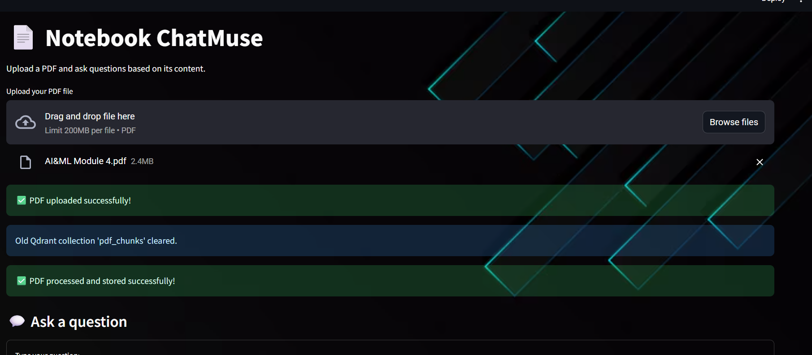

 #Notebook ChatBot using Streamlit, LangChain, Qdrant, and Ollama[Llama3.2]

Notebook ChatMuse is a **local PDF-based AI chatbot** built with **Streamlit**, **LangChain**, **Qdrant**, and **Ollama (LLaMA3)**. You can upload pdf, ask questions about them, get answers, hear responses in voice (TTS), and download chat history.

---

## 🚀 Features

- 📂 Upload and query **PDFs**
- 🧠 **LangChain** with **HuggingFace embeddings**
- 🗄️ **Qdrant** vector database (on-premise)
- 🦙 **LLaMA3** LLM via Ollama (local inference)
- 💬 Chat interface with **chat history & toggleable answers**
- 🎧 **Text-to-Speech (TTS)** with gTTS
- 💾 Download full conversation history
- 🌐 All offline — **no internet or API key needed**

---

## 🖥️ Demo Screenshot

>

---

## ⚙️ Installation

### 1. Clone the repo

```bash
git clone https://github.com/yourusername/pdf-chatbot.git
cd pdf-chatbot


2. Install requirements
pip install -r requirements.txt

3. Run Qdrant (if not already running)
docker run -p 6333:6333 qdrant/qdrant

4.Run the chatbot
streamlit run app.py


